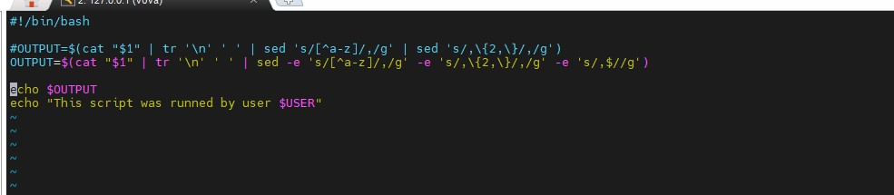

# Task 1.3

## Write a simple parser script that uses 1 env variable;
**Convert this: 
a,b;c^d"e} 
f;g,h!;i8j- 
To this: 
a,b,c,d,e,f,g,h,i,j **

I had been trying some variations of using `IFS` to manipulate this symbols in the right way. But nothing worked.

As a result, my script works without an environment variable. (not taking into account some cheats)

Screenshot was updated  
I decide to add `-e` option to remove some pipes `|`.
