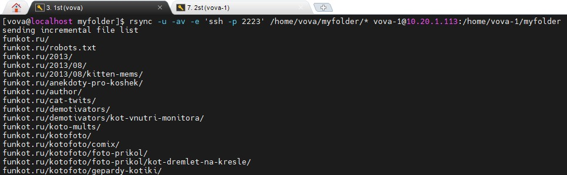
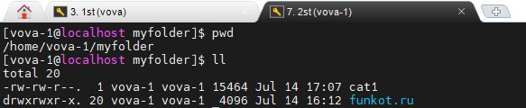
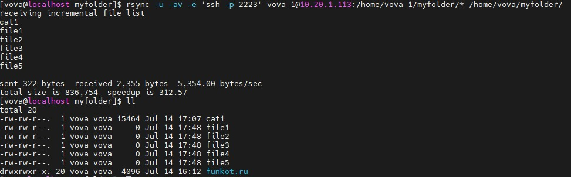
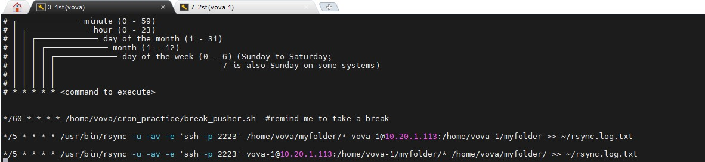
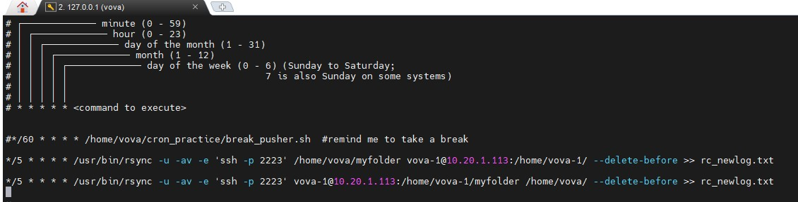

# Task 1.5
## Synchronize data form 1st Linux VM to 2nd Linux VM in the folder /home/<user>/myfolder every 5 minutes (install 2 VMs with Centos for this task).  Try doing it with both rsync and scp;

## rsync
We have two VMs behind the NAT. So, I used port forwarding to be able to configure connection between them. So the target IP is my Host's ip. In that case I have to specify port within the following command.

`rsync -u -av -e 'ssh -p 2223' /home/vova/myfolder/* vova-1@10.20.1.113:/home/vova-1/myfolder`

Let's create some file{1..5} on the 2th VM and make this command synchronize it back.

`rsync -u -av -e 'ssh -p 2223' vova-1@10.20.1.113:/home/vova-1/myfolder/* /home/vova/myfolder/`

Hooray!

Now using `crontab -e` we gonna add cronjobs those will synchronize two VMs every 5 minutes automatically

One step was missing. ssh keys was forwarded days ago, so I forgot mention it. That's why 2th VM didn't ask me the password.

**UPDATE**

There was a problem with last solution. When files were deleted from SOURCE, they were not deleted from TARGET, after which they were pulled back to the SOURCE. I made some changes:

`*/5 * * * * /usr/bin/rsync -u -av -e 'ssh -p 2223' /home/vova/myfolder vova-1@10.20.1.113:/home/vova-1/ --delete-before `

Now it works better.

**UPDATE#2**

## scp

Using `scp` a way harder for this purpose.

`scp -r -P 2223 ~/myfolder2/* vova-1@10.20.1.113:~/myfolder2`

Just copy. Can be done in both directions. But no synchronization for deleted files. Also overwrites files..

No time for research for now. Maybe later.
