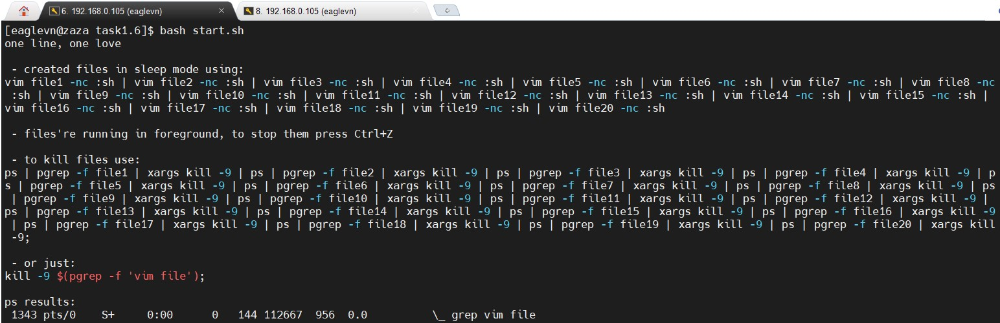
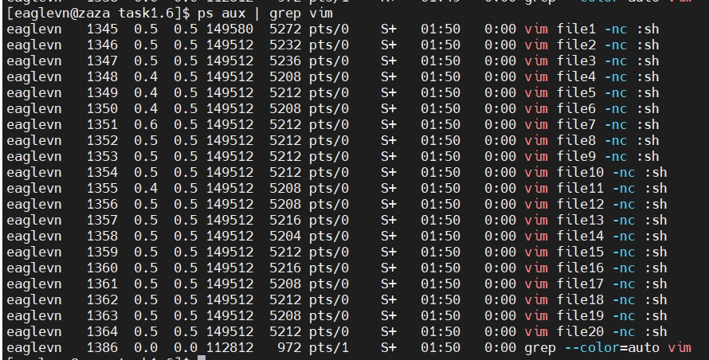
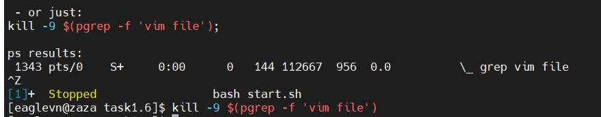
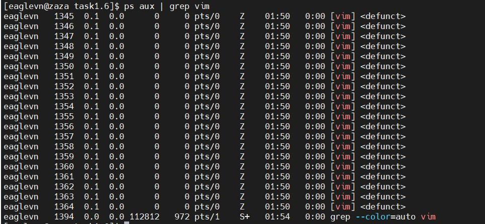

# Task 1.6

## Create a situation where you have following files open in vim FILE1...FILE20. And put all files to sleep in the same bash instance. This will leave you with 20 vim instances. Kill all files with pattern "FILE1" using a for loop. (see if you can do this in a single line).

I did it with a friend. This is about 30% of my contribution.
It was fun.
It is not recommended to run. Many terminal windows have fallen

The end result is not as expected.
